#№Задание 1
##1)
Для вывода результата команды в task_1.py необходимо использовать команду print()

В REPL же изначально встроена команда print(), поэтому он печатает результат.
##2)
###Выражения:

    "Python"
    4 * 2
    f"{course}: {hours} часов"

###Инструкции:

    course = "Python"
    hours = 4 * 2

###Литералы:

    "Python"
    4
    2
    f"{course}: {hours} часов"
###Имена переменных:

    course
    hours
##3)
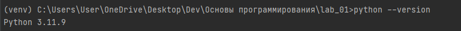

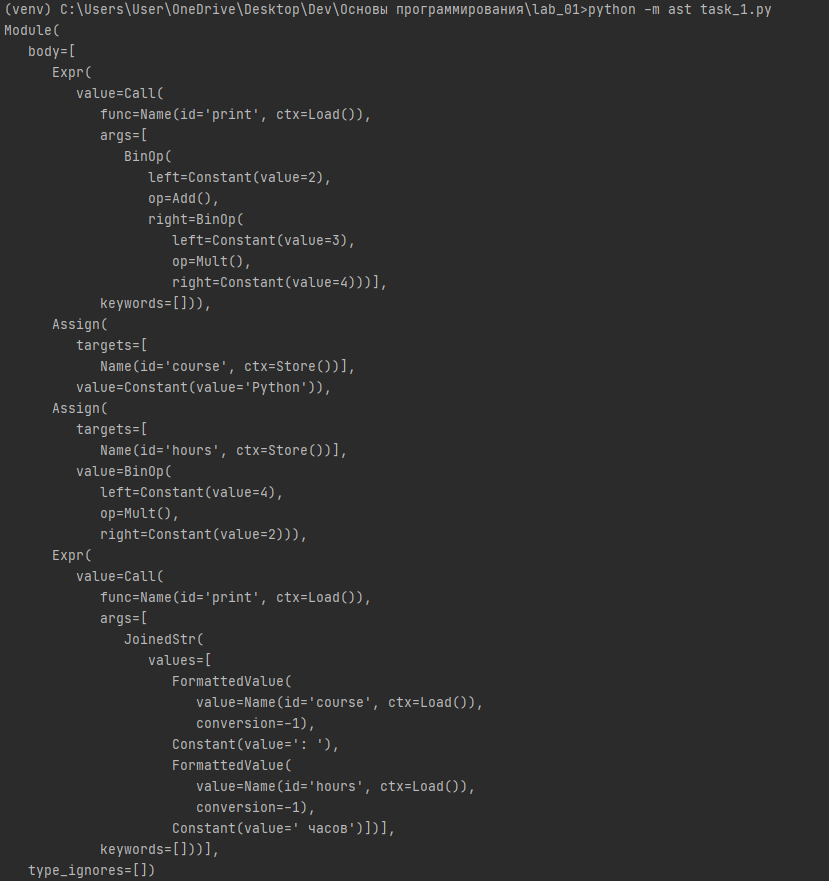

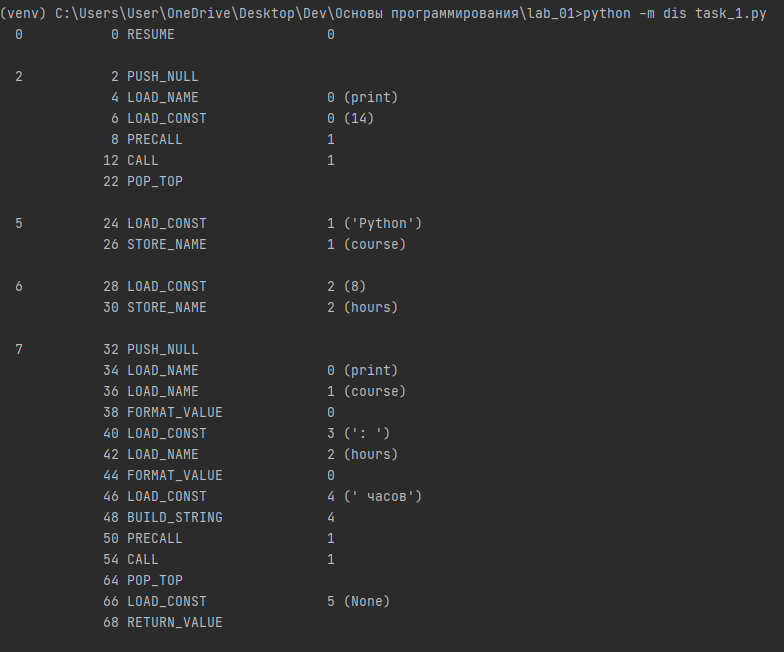

###Присваивание:

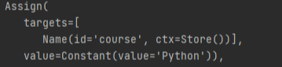

###Арифметическая операция:

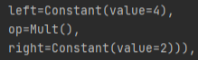

###Функция print():

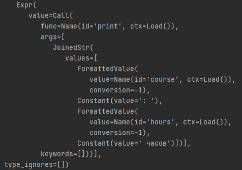

###Загрузка константы:

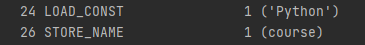

###Вызов функции:

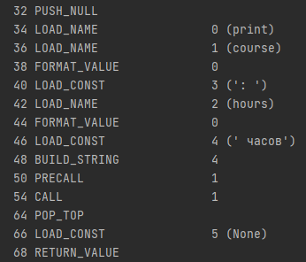

###Почему байткод CPython нельзя считать машинным кодом процессора?

Байткод CPython - промежуточное представление программы для виртуальной машины,
а машинный код - это инструкции для реального процессора

#Задание 2

##1)
###Прогноз:
Все 4 результата выполнения программы будут True.
###Результаты вычислений:
Результат выражения "a is c" False, т.к. a и c - это разные объекты памяти Python с разными идентификаторами.
###Схема связи между именами и объектами
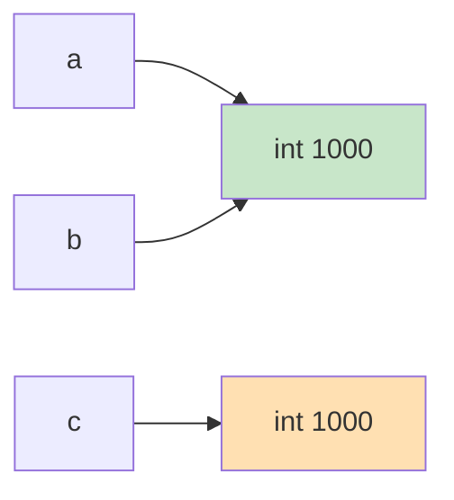

##2)
###Разница между равенством значений и идентичностью объектов:
Обьекты индентичны, если ссылаются на один и тот же объект из кэша CPython.
У обьектов, имеющих равные значения, могут быть разные объекты-ссылки из кэша CPython.
##3)

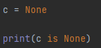

##4)
Оба варианта проверки на равенство выдают результат True, т.к в случае сравнения через "==" сравниваются значения результат будет True, ведь строки равны. 
В случае проверки через "is" результат также будет True, ведь при конкатенации строк через "+" python ещё на этапе компиляции складывает эти строки и ссылает их на уже созданный объект "Python". 

##5)
В Python "==" используется для сравнения значений, а "is" - только для проверки на None/True/False
###Создает ли инструкция b = a копию объекта?
1.Инструкция b = a не создаёт копию объекта, а лишь привязывает новое имя b к тому же самому объекту, на который ссылается a
###Что возвращают type() и id()?
2.type() возвращает тип объекта, а id() - его уникальный идентификатор - адрес в памяти.
###Почему None принято сравнивать с помощью is, а числа и строки — с помощью ==?
None в программе существует только в одном экземпляре, поэтому гораздо проще сравнить обьект через "is", тогда как числа и строки сравниваются через ==, так как важно их значение, а не конкретный объект в памяти.
#Задание 3
###A)
"/" - деление - В случае не целочисленного деления возвращает десятичную дробь
"//" - целочисленное деление - В случае деления не на цело возвращает целую часть десятичной дроби
###B)
Целые числа в Python имеют произвольную точность и могут расти до любого размера, ограничиваясь лишь объёмом памяти, тогда как целые фиксированной разрядности в других языках занимают строго определённое число бит.
###C)
####Обьяснение:
Десятичные дроби в двоичной системе - бесконечные периодические дроби. Тип float хранит ограниченное число бит, поэтому десятичные дроби округляются в большую сторону, что приводит к неожиданному ответу.
Поэтому проверка "0.1 + 0.2 == 0.3" возвращает результат False.

####Правило:
Нельзя сравнивать значения типа float через "==", это не всегда вернет достоверный результат.
Необходимо использовать math.isclose().

###D)
####Почему bool("False") дает истинное значение?
Метод bool() для строки сравнивает содержимое, а не саму строку. В случае, если строка не пустая, возвращается значение True.

###Контрольные вопросы

####Почему результат обычного деления двух объектов int имеет тип float?
Оператор "/" в Python всегда возвращает число с плавающей точкой типа float, даже если оба операнда являются целыми числами, и деление происходит без остатка.
####В чем отличие преобразования int("42") от int(42.9)?
int("42") переводит "42" типа str в тип int, а выходе получается 42.

int(42.9) переводит 42.9 типа float в тип int, отбрасывает дробную часть числа, а выходе получается 42.
####Какие значения из эксперимента D являются falsy?
bool(0)
bool("")

#Задание 4
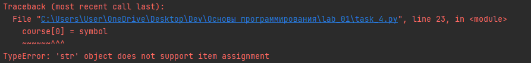
###Контрольные вопросы
####Почему len(symbol) и len(symbol.encode("utf-8")) могут различаться?
Метод len(symbol) считает количество символов в строке, а len(symbol.encode("utf-8")) байты.
Один символ не всегда занимает 1 байт памяти, поэтому значения, возвращаемые методами, могу отличаться.
####Что означают границы и шаг в записи text[start:stop:step]?
start - левая граница среза (включительно)
stop - правая граница среза (не включительно)
step - шаг среза(например, step=2 обозначает, что возвращается каждый 2 символ строки)
####Почему строка считается неизменяемым объектом, хотя методы вроде upper() возвращают измененный текст?
Строка считается неизменяемым объектом, потому что после её создания содержимое в памяти изменить физически нельзя.
Когда вызываются методы вроде upper(), создаётся новый объект с изменённым содержимым, а исходная строка остаётся нетронутой.
#Задание 5
###1.Типы имён после выполнения
    name — str
    experiment — str
    runs — int
    duration — float
    real — float
    imag — float
    total_sec — float
    total_min — float
    coef — complex
    mod_sq — float
    has_runs — bool
###2. Разбор строки "mod_sq = real ** 2 + imag ** 2"
    Имена: mod_sq, real, imag
    Литералы: 2, 2
    Операторы: =, **, +, **
    Вызовы функций: нет
###3. Путь программы
Исходный файл, разбор текста на токены, построение AST, компиляция в байткод, выполнение виртуальной машиной CPython.
###4. Почему результат input() необходимо явно преобразовывать перед арифметическими вычислениями
input() всегда возвращает строку. Строку нельзя использовать в арифметике с числами, будет ошибка. Поэтому её явно преобразуют через int() или float(), чтобы получить число нужного типа.
###Контрольный вопрос
При повторном присваивании имя просто перепривязывается к новому объекту, а старый объект остаётся неизменным и удаляется сборщиком мусора, если на него больше нет ссылок.

#Вывод:

Самыми неожиданными оказались особенности:

1.Имя это ярлык, его можно перепривязать к другому объекту, а старый объект при этом не меняется.

2.Разница между "==" и "is": "==" сравнивает значения, а "is" проверяет, один ли это объект в памяти, и они не всегда возвращают одинаковый результат.

3.Поведение float: 0.1 + 0.2 не равно 0.3 из-за двоичного представления.

